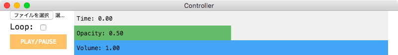

# Wanwanwanwawanwanwawawa

Semitransparent video player implemented by Electron.


## Usage

### Install

Requirements: Electron v1.3.1

```
git clone https://github.com/mimorisuzuko/wanwanwanwawanwanwawawa.git
cd wanwanwanwawanwanwawawa
npm i
npm start
```

### Controller



When user selected a video file, the player play the video. Also, user can change the current time, the opacity of player, the volume, the loop.

## Acknowledgments

I want to thank [イチズレシピ / アイドルカレッジ](https://youtu.be/252Tp9_VUC0).